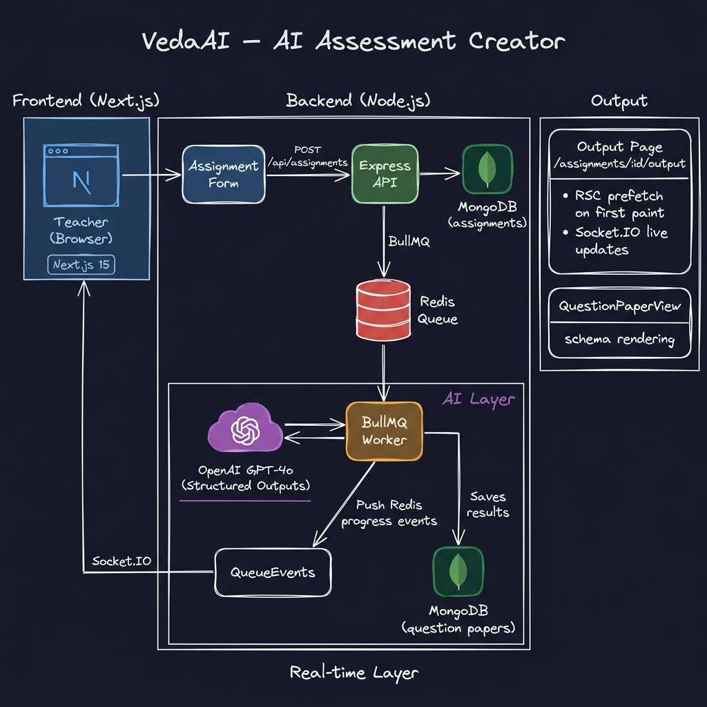

# VedaAI — AI Assessment Creator

> A full-stack monorepo that lets teachers create assignments and instantly generate structured question papers powered by OpenAI — with real-time progress streamed over WebSocket and optional visual context from an uploaded reference image.

[](https://nodejs.org) [](https://pnpm.io) [](https://nextjs.org) [](https://platform.openai.com)

[Figma Designs →](https://www.figma.com/design/voWYBzUZg018Iy258LQT5H/Untitled)

---

## Table of Contents

- [Quick Start](#quick-start)
- [Architecture Overview](#architecture-overview)
- [Project Flow Diagram](#project-flow-diagram)
- [Approach](#approach)
- [Image Upload Pipeline](#image-upload-pipeline)
- [Packages & Apps](#packages--apps)
- [Request Flows](#request-flows)
- [Environment Variables](#environment-variables)
- [Scripts](#scripts)
- [Bonus Features](#bonus-features)
- [Routes](#routes)

---

## Quick Start

**Prerequisites:** Node ≥ 20, pnpm 9, a running MongoDB and Redis instance, an OpenAI API key.

```bash
# 1. Clone and install
git clone <repo-url>
cd vedaai
pnpm install

# 2. Configure environment
cp .env.example .env
# → Open .env and set OPENAI_API_KEY (and adjust MongoDB/Redis URLs if needed)
# → OPENAI_MODEL=gpt-4o-mini   (must be a vision-capable model)

# 3. Run all services in parallel
pnpm dev
```

| Service | URL |
|---------|-----|
| Web (Next.js) | http://localhost:3000 |
| API (Express) | http://localhost:4001 |
| Worker | (background process, no HTTP port) |

---

## Architecture Overview

VedaAI follows a **pnpm monorepo** structure with three independently deployable applications (`apps/`) and six shared packages (`packages/`).

```
vedaai/
├── apps/
│   ├── web/        Next.js 15 App Router — SSR, SEO, real-time output view
│   ├── api/        Express + MongoDB + BullMQ producer + Socket.IO server
│   └── worker/     BullMQ consumer — OpenAI two-step generation pipeline
│
└── packages/
    ├── config/     Typed, validated environment loading (API vs Worker)
    ├── content/    Shared copy, nav constants, form field definitions
    ├── types/      Domain TypeScript models (Assignment, QuestionPaper, …)
    ├── ui/         Shared React components (QuestionPaperView, layout shell)
    ├── validation/ Zod API contracts (CreateAssignmentDto, imageBase64, …)
    └── websocket/  Socket event name constants and room helpers
```

### Key Architectural Decisions

| Decision | Rationale |
|----------|-----------|
| **Monorepo (pnpm workspaces)** | Single `pnpm dev` starts everything; packages share TypeScript types with zero duplication |
| **Next.js App Router (Server Components by default)** | SSR on every page for SEO; `"use client"` only at interactive leaves (forms, socket subscriber) |
| **No `useEffect` for data fetching** | All list/detail fetches run in RSC (`lib/api/*`); avoids waterfall and hydration mismatches |
| **BullMQ + Redis queue** | Decouples the slow AI generation from the HTTP request; jobs survive worker restarts |
| **Two-step OpenAI pipeline** | Vision pre-pass (non-strict) → structured output parse (strict Zod schema) — avoids OpenAI's hard limit on combining image_url content with strict structured outputs |
| **Socket.IO rooms per assignment** | Each client subscribes to `assignment:<id>` — no broadcast leakage between users |
| **Zustand for ephemeral state only** | Form draft (including base64 image) and live generation status live in Zustand; persistent data always comes from the server |
| **Body size limits raised** | `next.config.ts` sets `serverActions.bodySizeLimit: "20mb"`; Express set to `20mb` — required to transmit base64 images through the pipeline |

---

## Project Flow Diagram

> End-to-end data flow from teacher form submission to rendered question paper.



```
┌──────────────────────────────────────────────────────────────────────────────────┐
│  FRONTEND  (Next.js 15 App Router)                                               │
│                                                                                  │
│  ┌───────────────────────────┐   Server Action   ┌──────────────────────────┐   │
│  │  /assignments/create      │ ──submitAssignment▶│  /assignments/:id/output │   │
│  │                           │                    │  RSC prefetches output   │   │
│  │  • Title / Subject / Class│                    │  Client → Socket.IO room │   │
│  │  • Due date               │                    │  QuestionPaperView       │   │
│  │  • Question types         │                    └──────────────────────────┘   │
│  │  • JPG/PNG upload         │                                                   │
│  │    (FileReader → base64   │                                                   │
│  │     stored in Zustand,    │                                                   │
│  │     sent as hidden input) │                                                   │
│  └───────────────────────────┘                                                   │
│           │ POST /api/assignments { ...fields, imageBase64?, imageMimeType? }    │
└───────────┼──────────────────────────────────────────────────────────────────────┘
            │                                                    ▲
            ▼                                                    │ Socket.IO events
┌───────────────────────────────────────────────────────────────────────────────┐
│  BACKEND  (Express API  :4001)                                 │               │
│                                                                │               │
│  ┌─────────────────┐  save   ┌────────────┐   QueueEvents     │               │
│  │  POST /api/…    │────────▶│  MongoDB   │   bridge          │               │
│  │  • Zod validate │         │ Assignment │   ┌───────────────┴──────┐        │
│  │  • imageBase64  │         └────────────┘   │  Socket.IO Server    │        │
│  │    included in  │                           │  room:assignment:<id>│        │
│  │    job payload  │  enqueue                  └──────────────────────┘        │
│  └─────────────────┘────────▶ BullMQ / Redis Queue                            │
└──────────────────────────────────────────────────────────────────────────────┘
                                      │ job picked up
                                      ▼
┌──────────────────────────────────────────────────────────────────────────────────┐
│  WORKER  (BullMQ Consumer)                                                       │
│                                                                                  │
│  ┌─────────────────────────────────────────────────────────────────────────┐    │
│  │  STEP 1 — Vision pre-pass  (only when imageBase64 present)              │    │
│  │                                                                         │    │
│  │    extractImageContext()                                                 │    │
│  │      → chat.completions.create  (non-strict, image_url content part)   │    │
│  │      → returns plain-text description of the image (≤300 tokens)       │    │
│  │      → best-effort: if it fails, generation continues without context   │    │
│  │                                                                         │    │
│  │  STEP 2 — Structured section generation  (for each question type)      │    │
│  │                                                                         │    │
│  │    generateSection(payload, sectionIndex, imageContext?)                │    │
│  │      → buildSectionPrompt()  ← injects imageContext as quoted text     │    │
│  │      → beta.chat.completions.parse(zodResponseFormat)  [strict JSON]   │    │
│  │      → job.updateProgress(10% → 70%)  ───────────────────────▶ Redis   │    │
│  │                                                                         │    │
│  │  STEP 3 — Answer key generation                                         │    │
│  │                                                                         │    │
│  │    generateAnswerKey(payload, sections)                                  │    │
│  │      → buildAnswerKeyPrompt()                                            │    │
│  │      → beta.chat.completions.parse(answerKeySchema)                     │    │
│  │      → job.updateProgress(85%) ────────────────────────────────▶ Redis  │    │
│  │                                                                         │    │
│  │  mapToQuestionPaper() → QuestionPaperModel.upsert() → MongoDB           │    │
│  │  AssignmentModel.update(status: "completed")                             │    │
│  │      → job.updateProgress(100%) ──────────────────────────────▶ Redis   │    │
│  └─────────────────────────────────────────────────────────────────────────┘    │
│                                                                                  │
│              ┌──────────────────────────────────────────────────┐               │
│              │  OpenAI GPT-4o-mini                              │               │
│              │  • Step 1: chat.completions.create  (vision)     │               │
│              │  • Step 2: beta.chat.completions.parse (strict)  │               │
│              └──────────────────────────────────────────────────┘               │
└──────────────────────────────────────────────────────────────────────────────────┘
```

---

## Approach

### 1. Form & Validation

The assignment creation form (`apps/web/src/components/assignments/assignment-form.tsx`) handles all fields in a single client component. Each text field is mirrored into a Zustand store (`assignment-store.ts`) for draft persistence. On submit, a **Next.js Server Action** (`submitAssignment`) receives `FormData` and validates everything server-side via Zod before calling the API — no raw `fetch` in the component.

**Image upload:** The file input is restricted to `.jpg/.jpeg/.png`. On file selection, a `FileReader` converts the bytes to a base64 string which is stored in the Zustand draft. Two hidden `<input>` elements (`imageBase64`, `imageMimeType`) inject the base64 into the form submission. Because Server Actions use their own FormData protocol (not URL-encoding), the base64 `+` and `=` characters are preserved correctly without `encType="multipart/form-data"`.

### 2. Two-Step AI Generation Pipeline

The worker uses a **two-step pipeline** to work around the OpenAI constraint that `strict` structured outputs refuse `image_url` content parts:

**Step 1 — Vision pre-pass** (`extractImageContext`)
- Runs `chat.completions.create` (non-strict, no JSON schema) with the image as an `image_url` content part
- Extracts a plain-text educational description of the image (≤300 tokens)
- Best-effort — if the vision call fails for any reason, generation continues without image context

**Step 2 — Structured generation** (`generateSection`)
- Runs `beta.chat.completions.parse` with `zodResponseFormat` (strict Zod schema)
- The image description from Step 1 is injected as a quoted text block in `buildSectionPrompt()`
- Called once per question-type section (A, B, C, D…)
- Each call emits a progress event back to the browser via Redis → QueueEvents → Socket.IO

**Step 3 — Answer key** (`generateAnswerKey`)
- Same structured parse approach, using `buildAnswerKeyPrompt` with all generated questions as context
- Does not use the image (no benefit after sections are already generated)

### 3. Real-time Progress (No Polling)

The output page subscribes to a Socket.IO room (`assignment:<id>`) only while `status !== "completed"`. Progress events carry `{ status, message, progress }` — the UI renders a live progress bar. On `completed`, the client fetches the final paper once via server-side RSC and drops the socket connection.

### 4. Structured Output — Never Render Raw LLM Text

Every LLM call uses `beta.chat.completions.parse()` with a Zod schema. If the model refuses or returns a malformed response, the worker throws immediately (no garbage stored). The `QuestionPaperView` component renders only typed `QuestionPaper` schema fields — no `dangerouslySetInnerHTML`, no raw strings.

### 5. SEO & Server Rendering

All pages use `generateMetadata()`. Lists and output pages are Server Components with data fetched at render time. `"use client"` is limited to three components: the assignment form (Zustand draft + FileReader), the socket subscriber, and `QuestionPaperView` (needs `window.print()`).

---

## Image Upload Pipeline

```
Browser                     Server Action               API / Worker
───────                     ─────────────               ────────────
User picks JPG/PNG
  │
FileReader.readAsDataURL()
  │
base64 → Zustand draft
  │
Hidden <input name="imageBase64">
Hidden <input name="imageMimeType">
  │
Form submit (Server Action)
  │──────── FormData ──────▶ formData.get("imageBase64")
                                      │
                             POST /api/assignments
                             { ...fields, imageBase64, imageMimeType }
                                      │
                             Zod validation (optional fields)
                                      │
                             BullMQ job { assignmentId, payload }
                             payload.imageBase64 ✓
                                      │
                                      ▼
                             Worker Step 1: extractImageContext()
                             chat.completions.create + image_url
                               → "The image shows a Class 11 Maths..."
                                      │
                             Worker Step 2: generateSection() × N
                             buildSectionPrompt(payload, i, imageContext)
                             beta.chat.completions.parse (strict)
                               → Typed section JSON ✓
```

**Why not send the image directly to the structured output call?**

OpenAI enforces that `strict: true` (used by `zodResponseFormat`) cannot be combined with `image_url` content parts. Attempting to do so causes an immediate model refusal. The two-step approach — describe the image first, then inject the description as text — is the correct workaround.

---

## Packages & Apps

| Package | Role |
|---------|------|
| `apps/web` | Next.js 15 App Router UI — SSR, SEO, assignment form (with image upload), output page |
| `apps/api` | Express REST API + Socket.IO server + BullMQ producer (20mb body limit) |
| `apps/worker` | BullMQ consumer — two-step vision + structured generation pipeline |
| `packages/ui` | Shared React components: `QuestionPaperView`, layout shell, nav |
| `packages/types` | Domain TypeScript models: `Assignment`, `QuestionPaper`, `CreateAssignmentInput` (incl. `imageBase64?`, `imageMimeType?`) |
| `packages/content` | Shared copy, nav items, question-type definitions |
| `packages/config` | Typed env loading with Zod — separate schemas for API vs Worker |
| `packages/validation` | Zod API contracts: `CreateAssignmentDto` (incl. `imageBase64?`, `imageMimeType?`) |
| `packages/websocket` | Socket event name constants + `assignmentRoom(id)` helper |

---

## Request Flows

### Create Assignment (with optional image)

```
Teacher fills form + optionally uploads JPG/PNG
  → FileReader converts image → base64 → Zustand draft
  → Hidden inputs inject imageBase64 + imageMimeType into FormData
  → Server Action submitAssignment()
    → Validates all fields (Zod)
    → POST /api/assignments { title, subject, ..., imageBase64?, imageMimeType? }
      → Zod validation on API (imageBase64 optional, imageMimeType enum)
      → Save Assignment to MongoDB (status: "queued")
      → Enqueue BullMQ job { assignmentId, payload } (payload includes image)
      → Return { assignmentId, status: "queued" }
    → Redirect to /assignments/:id/output
```

### Generate Question Paper (Worker — Two-Step)

```
Worker dequeues job
  → Log: "image attached: true/false"
  → Mark assignment status: "processing"

  → [if imageBase64 present]
      Step 1: extractImageContext()
        → chat.completions.create(image_url + text, non-strict)
        → Returns plain-text image description
        → job.updateProgress(8%, "Analysing reference image…")

  → Step 2: For each questionType section (A, B, C…):
      → buildSectionPrompt(payload, i, imageContext?)
          → Injects imageContext as quoted block in prompt text
      → beta.chat.completions.parse(zodResponseFormat(sectionSchema))
      → job.updateProgress(10%→70%, "Generated Section X…")

  → Step 3: generateAnswerKey()
      → buildAnswerKeyPrompt(payload, sections)
      → beta.chat.completions.parse(answerKeySchema)
      → job.updateProgress(85%, "Saving question paper…")

  → mapToQuestionPaper() → QuestionPaperModel.upsert()
  → AssignmentModel.update(status: "completed")
  → job.updateProgress(100%, "Your question paper is ready!")
```

### View Output

```
Browser navigates to /assignments/:id/output
  → RSC fetches GET /api/assignments/:id/output (server-side, first paint)
  → If status ≠ completed:
      → Client subscribes to Socket.IO room assignment:<id>
      → Renders Spinner + ProgressBar with live events
      → On "completed" event: fetch final paper, unsubscribe socket
  → QuestionPaperView renders typed QuestionPaper schema
```

---

## Environment Variables

Copy `.env.example` to `.env` and fill in your values:

```bash
cp .env.example .env
```

| Variable | Used By | Description |
|----------|---------|-------------|
| `MONGODB_URI` | API, Worker | MongoDB connection string |
| `REDIS_URL` | API, Worker | Redis connection URL |
| `API_PORT` | API | Port for Express server (default: 4001) |
| `CORS_ORIGIN` | API | Allowed CORS origin (e.g. `http://localhost:3000`) |
| `API_URL` | Web (server) | Server-side API URL for RSC data fetching |
| `NEXT_PUBLIC_API_URL` | Web (client) | Client-side API URL for Socket.IO |
| `OPENAI_API_KEY` | Worker | Your OpenAI API key |
| `OPENAI_MODEL` | Worker | Vision-capable model name (e.g. `gpt-4o-mini`, `gpt-4o`) |

> **Note:** `OPENAI_MODEL` must be a **vision-capable** model. Both `gpt-4o` and `gpt-4o-mini` work. The image is sent in Step 1 (non-strict vision call); Step 2 uses text-only strict structured outputs.

---

## Scripts

```bash
pnpm dev          # Start web + api + worker in parallel
pnpm dev:web      # Web only (port 3000)
pnpm dev:api      # API only (port 4001)
pnpm dev:worker   # Worker only
pnpm build        # Build all apps and packages
pnpm typecheck    # TypeScript check across the monorepo
pnpm lint         # ESLint (web app)
```

---

## Routes

| Route | Type | Purpose |
|-------|------|---------|
| `/` | Redirect | → `/assignments` |
| `/assignments` | SSR (RSC) | Assignment list with status badges |
| `/assignments/create` | Client | Multi-field assignment creation form with JPG/PNG image upload |
| `/assignments/:id/output` | SSR + WS | Generated question paper + live progress bar |

---

## Bonus Features

### ✅ Image-Inspired Question Generation

Teachers can upload a **JPG or PNG** reference image (e.g. a chapter page, diagram, or existing paper) during assignment creation. The worker uses a two-step pipeline:

1. **Vision pre-pass** — `chat.completions.create` reads the image and returns a text description
2. **Context injection** — the description is embedded in the section prompt as a quoted block, inspiring question topics, scenarios, and diagram references

The image context flows through the full type chain: Zod schema → BullMQ job → worker — never stored in MongoDB (only the resulting question paper is persisted).

### ✅ PDF Export

The `QuestionPaperView` includes a **"Download as PDF"** button that calls `window.print()` with a dedicated `@media print` stylesheet:

- Answer key breaks to a new page (`print:break-before-page`)
- Dark header banner is hidden in print (`print:hidden`)
- Shadows and rounded corners are stripped (`print:shadow-none print:rounded-none`)
- Section orphan prevention (`print:break-inside-avoid`)

The result is a clean, exam-paper-formatted PDF matching real CBSE/ICSE layouts — not a raw browser dump.

### ✅ Better Caching

| Layer | Mechanism |
|-------|-----------|
| **Queue state** | BullMQ persists job state in Redis — worker restarts don't lose in-progress jobs |
| **Output prefetch** | RSC fetches the final paper server-side on first load — zero additional client round-trip |
| **Socket unsubscribe** | After `completed`, the Socket.IO subscription is dropped — no zombie connections |
| **Rate-limit retry** | `generate.ts` implements exponential back-off (up to 5 retries, honouring `Retry-After` headers) for OpenAI 429 responses |
| **Body limits** | Next.js `serverActions.bodySizeLimit: "20mb"` + Express `20mb` body limit — supports images up to ~15MB raw (base64 overhead accounted for) |

### ✅ Improved UI Polish

- **Exam-paper typography** — `QuestionPaperView` matches real printed exam papers: school name centered, time/marks row, field lines for Name/Roll/Section, bold section headings
- **Difficulty tags** — each question shows `[Easy]`, `[Moderate]`, or `[Challenging]` inline
- **Live progress bar** — real-time `progress` value (0–100 %) with descriptive status messages streamed from the worker (including "Analysing reference image…" when an image is uploaded)
- **Dark action banner** — glassmorphism intro message banner above the paper with the PDF download button
- **Mobile responsive** — responsive Tailwind breakpoints; paper view adapts from single-column mobile to full-page desktop layout
- **Skeleton / loading states** — output page shows a spinner + animated progress bar while generation is running
